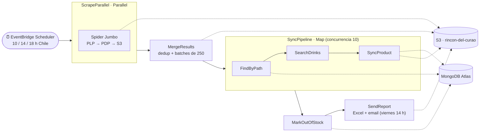

# RDC Scraper

Scraper serverless de **precios de bebidas** para e-commerce chilenos. Corre en AWS,
orquestado con **Step Functions** y desplegado con **AWS SAM**. Cada corrida scrapea las
tiendas en paralelo, consolida los resultados, los sincroniza contra la base de productos
(MongoDB Atlas) y envía un reporte semanal de los productos sin match.

- **Runtime:** Python 3.14 · x86_64
- **Dependencias:** [uv](https://docs.astral.sh/uv/) (workspace + `uv.lock`)
- **IaC / deploy:** AWS SAM (`template.yaml` + `samconfig.toml`)
- **Orquestación:** AWS Step Functions (Standard)
- **Datos:** MongoDB Atlas (`pymongo` async) · imágenes e intermedios en S3
- **Región:** `sa-east-1`

> El diseño completo, las decisiones de arquitectura y el registro fase por fase están en
> [`PLAN.md`](./PLAN.md).

---

## Arquitectura

El pipeline es una máquina de estados de Step Functions (`RDCScraper-Orchestrator`) con cinco
etapas. La entrada la dispara EventBridge Scheduler; cada etapa es una (o varias) Lambda.



1. **ScrapeParallel** — lanza todos los spiders en paralelo (una rama por spider). Cada spider
   scrapea PLP → PDP y sube su run JSON a `s3://rincon-del-curao/pipeline/`.
2. **MergeResults** — carga los runs, deduplica por URL, agrupa por categoría y escribe *batches*
   de 250 productos en S3.
3. **SyncPipeline** (`Map`, concurrencia 10) — por cada batch:
   - **FindByPath** — match por `websites.path`; actualiza precio/stock; enruta el resto.
   - **SearchDrinks** — busca los remaining en la RDC Drinks API y elige el mejor match por nombre.
   - **SyncProduct** — `add_website` o `create_product` (+ imagen WebP a S3); *gate* de allowlist por tienda.
4. **MarkOutOfStock** — marca `inStock: false` los websites no vistos en esta corrida
   (`lastUpdate != sync_token`).
5. **SendReport** — junta los productos sin match desde S3, genera un Excel y lo envía por email
   (Resend). El envío se gatea a **viernes 14:00 hora de Chile**.

### Scheduling

`EventBridge Scheduler` dispara el pipeline **3 veces al día — 10:00, 14:00 y 18:00 hora de Chile**
(`America/Santiago`, con DST). El reporte por email solo sale en la corrida del viernes a las 14:00.

### Contrato común

Los spiders son independientes (config propia en código, sin `BaseSpider`). Lo único homogéneo:

- **`ScrapedProduct`** — estructura de salida común (`rdc_utils.standard_format`).
- **Fetchers** — lógica de fetch JSON / HTML / Proxy compartida (`rdc_utils.fetchers`).

---

## Estructura del repo

```
rdc-scraper/
├── template.yaml              # SAM: recursos AWS + state machine
├── samconfig.toml             # (gitignored) parámetros reales de deploy
├── pyproject.toml             # workspace uv + dev-deps (ruff, pytest)
├── uv.lock                    # lockfile reproducible
├── Makefile                   # atajos: build, deploy, seed, test, lint
│
├── seed/infos.json            # metadata de tiendas → colección `infos` de Mongo
├── scripts/
│   ├── init_db.py             # crea colecciones e índices en Mongo (idempotente)
│   ├── seed_infos.py          # siembra la metadata de tiendas (allowlist de `source`)
│   └── run_spider_local.py    # ejecuta un spider en local (sin AWS)
│
└── src/
    ├── layers/                # Lambda Layers compartidas
    │   ├── utils/             # fetchers, standard_format, naming, mappings (aiohttp, bs4)
    │   └── database/          # acceso a Mongo Atlas (pymongo); depende de utils
    ├── spiders/               # 1 Lambda independiente por sitio
    │   └── jumbo/             # handler + spider + config
    └── pipeline/              # 1 Lambda por etapa del pipeline
        ├── merge_results/
        ├── find_by_path/
        ├── search_drinks/
        ├── sync_product/
        ├── mark_out_of_stock/
        └── send_report/
```

---

## Requisitos

- [uv](https://docs.astral.sh/uv/) (gestiona Python 3.14 + venv + dependencias)
- AWS CLI v2 (`aws configure`, región `sa-east-1`)
- AWS SAM CLI
- Docker (para `sam build --use-container`: compila deps nativas para Amazon Linux / x86_64)

```bash
# uv instala y fija Python 3.14
uv python install 3.14
uv python pin 3.14

# instala el workspace completo + dev tools (ruff, pytest)
uv sync --all-packages
```

Servicios externos: **MongoDB Atlas** (URI + IP allowlist), **Resend** (API key + remitente
verificado), **RDC Drinks API** (URL + key) y, opcionalmente, un **proxy anti-bot**.

---

## Configuración

Los parámetros reales de deploy viven en `samconfig.toml`, que **está gitignored** porque
contiene secretos (URI de Mongo, API keys de Resend/Drinks). Crea el tuyo con esta forma:

```toml
version = 0.1

[default.deploy.parameters]
stack_name = "rdc-scraper"
resolve_s3 = true
s3_prefix = "rdc-scraper"
region = "sa-east-1"
confirm_changeset = false
capabilities = "CAPABILITY_NAMED_IAM"
parameter_overrides = [
    "S3ImagesBucket=rincon-del-curao",
    "MongoDbUri=<mongodb+srv://...>",
    "MongoDbDatabase=develop",
    "DrinksApiUrl=<https://.../v1/>",
    "DrinksApiKey=<...>",
    "ResendApiKey=<...>",
    'EmailSender="RDC Scraper <onboarding@resend.dev>"',
    "EmailRecipient=<tu-email>",
]

[default.global.parameters]
region = "sa-east-1"
```

---

## Uso

Todos los flujos están en el `Makefile`:

```bash
make sync        # instala/actualiza el workspace desde uv.lock
make export      # genera un requirements.txt por artefacto desde el lockfile
make build       # export + sam build --use-container
make deploy      # build + sam deploy (usa samconfig.toml)
make validate    # sam validate --lint
make test        # pytest
make lint        # ruff check
make fmt         # ruff format
make clean       # borra .aws-sam y __pycache__
```

### Preparar la base de datos (una sola vez)

```bash
# crea colecciones e índices (idempotente; no siembra datos)
make init-db MONGODB_URI="mongodb+srv://..." MONGODB_DB="develop"

# siembra la metadata de tiendas (allowlist de `source`) desde seed/infos.json
make seed MONGODB_URI="mongodb+srv://..." MONGODB_DB="develop"
```

### Desplegar

```bash
make deploy
```

> **Docker es obligatorio** para el build: `Pillow` y otras deps con binarios nativos deben
> compilarse para el entorno de Lambda. No lances builds concurrentes.

### Ejecutar un spider en local

```bash
uv run scripts/run_spider_local.py
```

---

## Tests

```bash
make test        # o: uv run pytest
```

Cubren los extractores del spider Jumbo y la lógica pura de las Lambdas del pipeline
(`merge_results`, `search_drinks`, `sync_product`, `send_report`). Los tests E2E contra AWS
están diferidos (ver `PLAN.md §10.1`).

---

## Recursos AWS

Creados por `template.yaml` (convención de nombres `RDCScraper-[Nombre]`):

- **S3** `rincon-del-curao` — imágenes públicas (`images/*`) + intermedios del pipeline
  (`pipeline/*`, privados, expiran a los 7 días vía *lifecycle rule*).
- **2 Lambda Layers** — `UtilsLayer`, `DatabaseLayer`.
- **8 Lambdas** — 1 spider (Jumbo) + 7 etapas del pipeline.
- **Step Functions** `RDCScraper-Orchestrator` (Standard).
- **IAM Roles** para Step Functions y EventBridge Scheduler (permisos mínimos).
- **EventBridge Scheduler** `RDCScraper-ScheduleTrigger` (cron 10/14/18 hora de Chile).
